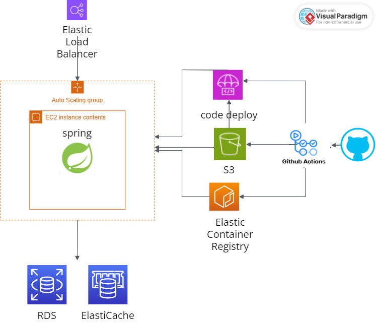
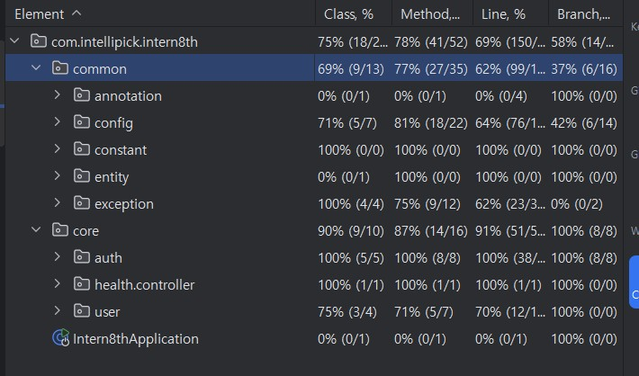
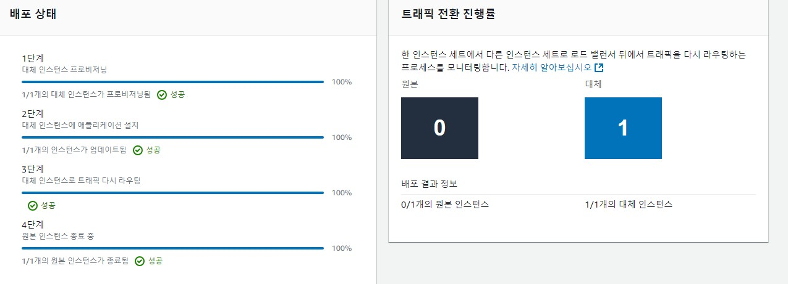
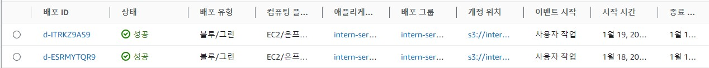

# 프로젝트명
인텔리픽 한달인턴 사전과제

## 요구사항
**Spring Security**
- Spring Security와 Jwt를 사용한 인증 인가작업 수행

**JWT**
-  Access / Refresh Token 발행과 검증에 관한 **테스트 시나리오** 작성하기

| 단위 시험 메서드            | createAccessToken           |
|-----------------------------|-----------------------------|
| **테스트 케이스 식별자**    | UT-TC-01-01                |
| **입력 데이터**             |`userId`: 1L             |
|                             |`userName`: james        |
|                             |`AuthorityName`: ROLE_USER |
| **설명**                   | 정상적으로 Access Token 생성 |
| **예상 출력**              | 정상 실행                   |

| 단위 시험 메서드         | createRefreshToken           |
|--------------------------|------------------------------|
| **테스트 케이스 식별자** | UT-TC-02-01                 |
| **입력 데이터**          | `userId` : 1L                  |
| **설명**                 | 정상적으로 Refresh Token 생성 |
| **예상 출력**            | 정상 실행                    |

| 단위 시험 메서드         | validateToken                | .| .|
|--------------------------|------------------------------|------------------------------|------------------------------|
| **테스트 케이스 식별자** | **입력 데이터**             | **설명**                          | **예상 출력**                                   |
| UT-TC-03-01             | eyJhbGciOi~                 | 유효한 토큰일 경우                 | true                                           |
| UT-TC-03-02             | BBJhbGciOi~                 | 잘못 서명된 토큰이 들어올 경우      | false, 401 에러 출력 및 로그   "잘못된 JWT 서명입니다." |
| UT-TC-03-03             | eyJhbGciOi~                 | 만료된 토큰일 경우                 | false, 401 에러 출력 및 로그   "만료된 JWT 토큰입니다." |
| UT-TC-03-04             | !das3l4@~                   | 지원되지 않은 토큰일 경우           | false, 401 에러 출력 및 로그   "지원되지 않는 토큰입니다." |
| UT-TC-03-05             | 빈값                        | null 등 잘못된 내용이 들어올 경우    | false, 401 에러 출력 및 로그   "JWT 토큰이 잘못되었습니다." |

**유닛 테스트 작성**
- JUnit를 이용한 JWT Unit 테스트 코드 작성해보기
- 백엔드 유닛 테스트 작성하기

**로직 작성**
- 회원가입 - /sginup
- 로그인 - /sign

**배포**
- Github Action을 통한 CI/CD
- 블루그린 무중단 배포

**SWAGGER**
- SWAGGER를 사용한 API 명세 작성
- http://intern-server-1632189670.ap-northeast-2.elb.amazonaws.com/swagger-ui/index.html
- 검색창에 /v3/api-docs 입력후 세부 내용을 확인, 결과를 볼 수 있습니다.

**AI-assisted programming**
- GitHub Copilot을 통한 코드리뷰 및 코드 리팩토링
- https://github.com/juno0432/intern-8th/pull/24/files

**마무리**

**시연 영상**

서버를 내린 관계로 아래 시연영상으로 대체하겠습니다

https://juno0432.tistory.com/196

비밀번호 : 1234
